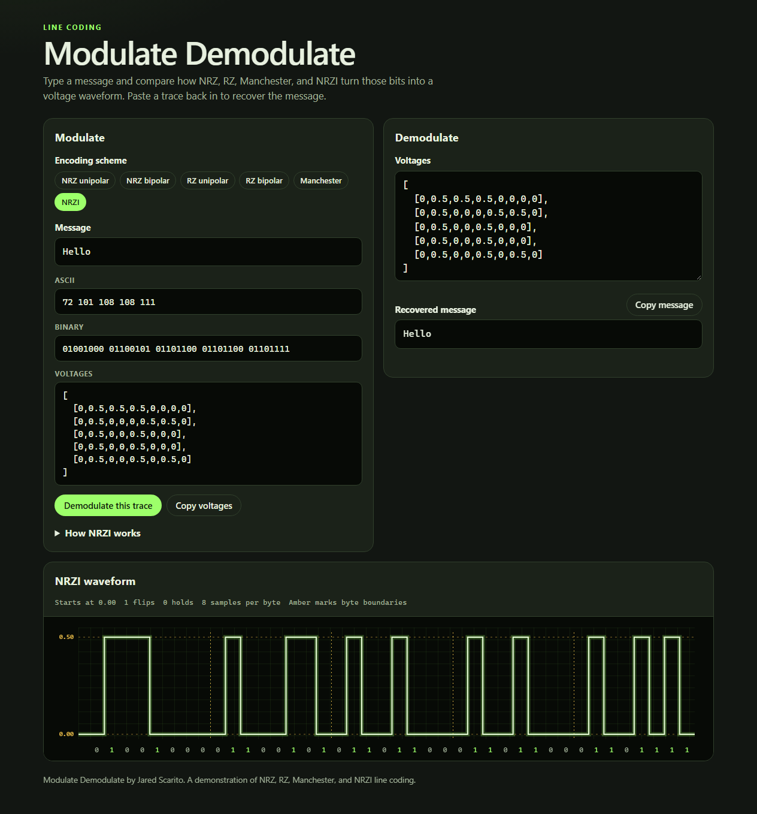
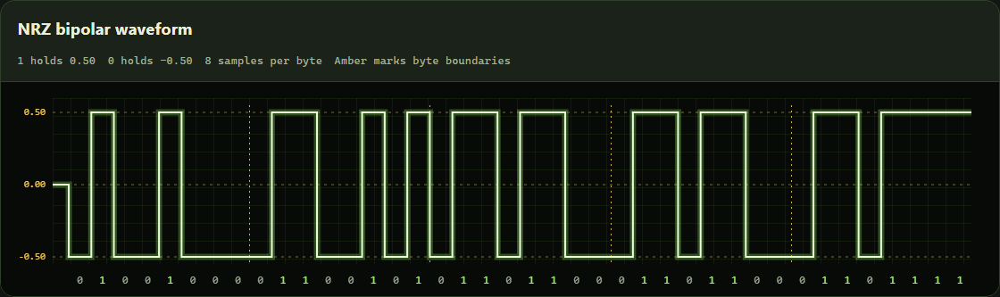
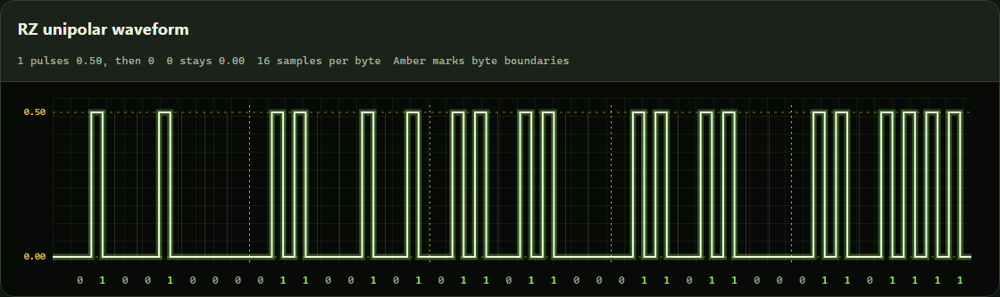
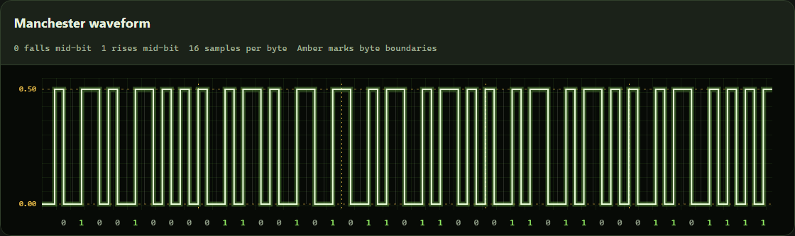

# ModulateDemodulate

ModulateDemodulate shows how text is modulated onto a voltage waveform, and how that waveform is demodulated back into text. A message becomes bytes, then bits, then one of the line codes below. Those voltages can be turned back into the original message.

The site is published at [jaredscar.github.io/ModulateDemodulate](https://jaredscar.github.io/ModulateDemodulate/). You can also open `index.html` in a browser.

## How to use

1. Type a message. Characters in the ASCII range stay one byte each. Anything else is encoded as UTF-8.
2. Choose a line code. The decimal bytes, 8-bit groups, voltage samples, and waveform update together.
3. Press **Demodulate this trace** to place those voltages in the decoder and recover the message. You can also paste a voltage array of your own. Decode it with the same scheme that created it.

Amber dashed lines on the graph mark where one byte ends and the next begins.

## Encoding schemes

Every scheme uses the levels **0.50**, **0.00**, and **−0.50**.

| Scheme | A 1 | A 0 | Samples per byte |
| --- | --- | --- | --- |
| NRZ unipolar | Holds 0.50 for the whole bit | Holds 0.00 for the whole bit | 8 |
| NRZ bipolar | Holds 0.50 for the whole bit | Holds −0.50 for the whole bit | 8 |
| RZ unipolar | Pulses to 0.50, then returns to 0.00 | Stays at 0.00 | 16 |
| RZ bipolar | Pulses to 0.50, then returns to 0.00 | Pulses to −0.50, then returns to 0.00 | 16 |
| Manchester | Rises from 0.00 to 0.50 in the middle of the bit | Falls from 0.50 to 0.00 in the middle of the bit | 16 |
| NRZI | Flips the line between 0.00 and 0.50 | Leaves the line where it was | 8 |

NRZI starts at 0.00 before the first bit, so the first 1 is a rising edge. A 0 means the voltage did not change from the previous bit.

The traces below are the message `Hello`.

### NRZ bipolar

### RZ unipolar

### Manchester

## Credit

ModulateDemodulate by Jared Scarito.
